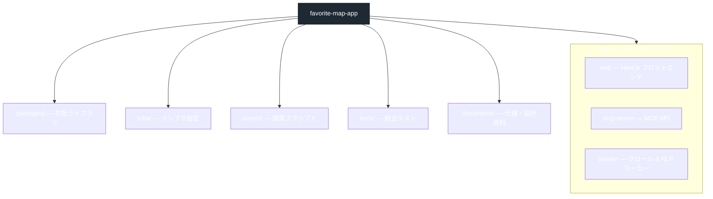

# favorite-map-app Architecture Guide (Ark)

このドキュメントは `folorders.md` のフォルダ構成を、アーキテクチャ視点でざっくり把握するためのメモです。モノレポのどこに何が入るか、そしてクリーンアーキテクチャ／オニオンアーキテクチャとの関係を初心者向けに解説します。

## 1. 全体像（モノレポ）

モノレポ構成にすることで、フロント・サーバー・ワーカー・共通ライブラリを 1 つのリポジトリでまとめて管理します。`pnpm-workspace.yaml` や `turbo.json` を使ってビルド／テストを並列実行する想定です。

## 2. アプリごとのレイヤーイメージ

### apps/web (Next.js App Router)
- `app/` … ルーティングとページの定義。`(public)` や `(authenticated)` のようなグループでアクセス制御を整理します。
- `components/` … 見た目に集中した再利用 UI。Google Maps 特化コンポーネントは `components/map` に隔離。
- `features/` … ドメイン単位（検索、フィルタ、キーワード管理など）の状態管理とビジネスロジック。
- `lib/` / `providers/` / `hooks/` … API クライアントや Context Provider、共通フックを配置。
- `tests/` … E2E（Playwright 等）とユニットテストを層ごとに分けます。

### apps/mcp-server (MCP API)
- `routes/` → HTTP 入口。リクエストを受けてバリデーション。
- `controllers/` → 入力をサービス層に橋渡し。
- `services/` → ビジネスロジック（Places と特徴量のマージ、フィルタリング）。
- `repositories/` → DB アクセス層。Prisma などを想定。
- `clients/` → Google API、LLM、Redis など外部サービス。
- `jobs/` → 定期ジョブやバッチ処理。

### apps/crawler (クロールワーカー)
- `queue/` → BullMQ 等でジョブキューを管理。
- `fetchers/` → Puppeteer/Playwright を使った取得処理。
- `extractors/` / `pipelines/` → HTML からテキスト化し NLP へ渡すパイプライン。
- `storage/` → 取得データの保存ロジック（S3、DB など）。

### packages/
- `shared-types/` … API のリクエスト/レスポンス型を共通化。
- `api-client/` … MCP サーバーを呼ぶための SDK。
- `ui/` … デザインシステム的なコンポーネント。
- `nlp/` … ルールベース抽出や LLM プロンプトを再利用可能に保管。
- `config/` … ESLint/Tailwind などの共通設定。

## 3. クリーンアーキテクチャ／オニオンアーキテクチャとの関係

| 観点 | Clean Architecture / Onion の考え方 | このプロジェクトでの位置付け |
|------|--------------------------------------|--------------------------------|
| ドメイン中心か | 内側ほどビジネスルール。外側はフレームワーク。 | `features/` や `services/` でビジネスロジックを分離し、UI やインフラ層から切り離す方針。 |
| 依存方向 | 内→外。内側は外側に依存しない。 | 完全な一方向依存ではないが、UI から `features`、`services` → `repositories` → `clients` のように段階的に依存させる想定。 |
| テスト容易性 | ドメイン層が薄いほどテストしやすい。 | 型共有 (`packages/shared-types`) やサービス層の切り出しでユニットテストしやすくしています。 |

### つまりどうなる？（初心者向けまとめ）
- **完全なクリーンアーキテクチャ／オニオンアーキテクチャではない** ように見えて大丈夫です。Next.js や Fastify などフレームワークが強く出るので、100% の純粋さを目指すより「ビジネスルールを UI / インフラから離しておく」ことを優先しています。
- `apps/web/features/*` や `apps/mcp-server/services/*` が「ドメインロジックの層」に当たり、外の層（UI、DB、外部 API）への依存を少なくします。
- フロントとサーバーの共通仕様は `packages/shared-types` にまとめ、どちらからも同じ型を使うことで境界をはっきりさせています。これは Clean/Onion でいう「境界線」を明確にするテクニックです。
- 将来さらに厳密な層分けが必要になった場合は、`features` や `services` をさらに `domain` / `usecases` / `infrastructure` のように分割することで、よりクリーンアーキテクチャに近づけられます。

## 4. 実装ステップの参考
- まずは `apps/web` のトップページと地図表示を実装し、`features/map` で地図表示ロジックを逃がす。
- 並行して `apps/mcp-server` の `routes/search` → `services/searchService` → `repositories/*` をモックデータで繋ぎ、依存方向を確認。
- `apps/crawler` と `packages/nlp` は MVP 後に追加し、`services` で受け取れる形のデータを投げるよう整備。
- CI では `turbo` や GitHub Actions から `pnpm test --filter "apps/..."` のように層ごとのテストを呼び出す運用を想定しています。

この ark.md を読みながら `folorders.md` を合わせて参照すると、どこにコードを置くべきか迷いづらくなります。わからない箇所があれば、どの層が責務を持つか（UI? ドメイン? インフラ?）を意識して決めていくと整理しやすいです。
