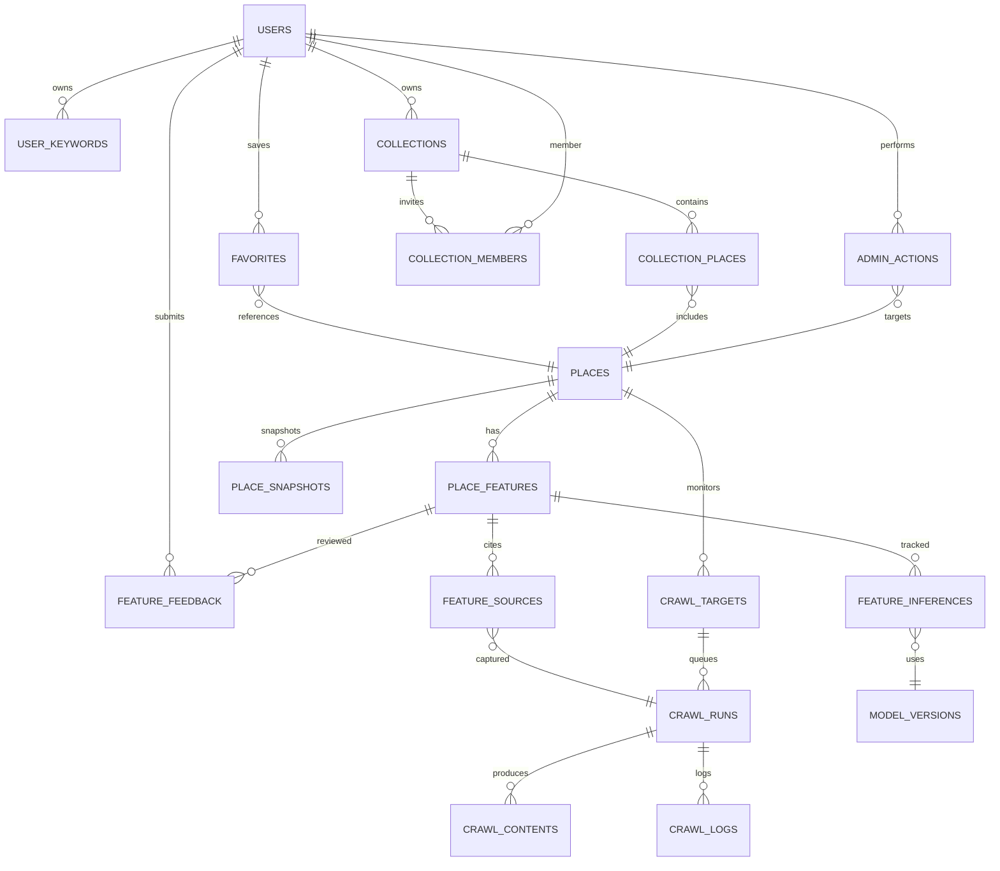

# favorite-map-app Database Design

このドキュメントは favorite-map-app のデータベース（PostgreSQL + PostGIS を想定）の論理設計をまとめたものです。MCP サーバーが主にアクセスし、Next.js フロントからは API 経由で利用します。初期実装で必要なテーブルに加え、将来拡張（共有リスト、再学習フィードバックなど）も見越した構成になっています。

## 1. 設計方針
- **Places データの正規化**: Google Places の基本情報は `places` に集約し、追加特徴は `place_features` で管理。履歴はスナップショットに切り出して肥大化を防ぎます。
- **クリーンアーキテクチャ志向**: ドメインロジックが扱うテーブル（例: `place_features`, `user_keywords`）をインフラ層（`crawl_runs`, `feature_sources` など）から分離。サービス層ではリポジトリ経由でアクセスする想定です。
- **JSONB + 参照テーブルの組み合わせ**: 生データや AI 出力は JSONB で柔軟に保持しつつ、検索に使う値はカラムとして取り出しておきます。
- **PostGIS を前提**: 位置検索のために `places.location` は `geography(Point, 4326)` 型を推奨します。

## 2. 主なユースケースとデータフロー
1. ユーザーがキーワードを登録 → `user_keywords`
2. マップ検索を行う → MCP API が `places` と `place_features` を結合して返却
3. クロールワーカーが URL を取得 → `crawl_targets` / `crawl_runs` に記録
4. NLP が特徴を抽出 → `place_features` を更新し、出典を `feature_sources` に残す
5. 管理者が判定を修正 → `feature_feedback` に保存し、再学習に利用

## 3. ER 図（概念レベル）



Mermaid のエッジ表記（例: `||--o{`）は 1 対多の関係を示し、`||` 側が 1、`o{` 側が多を意味します。


## 4. テーブル定義

### 4.1 認証・ユーザ関連
NextAuth.js の標準テーブル（`users`, `accounts`, `sessions`, `verification_tokens`）を利用します。必要なら Prisma の `@map` で命名調整してください。

| テーブル | カラム | 型 | 説明 |
|----------|--------|----|------|
| `users` | `id` | `uuid` PK | ユーザー ID。NextAuth 既定。|
| | `email` | `citext` Unique | メールアドレス。大文字小文字を区別しない `citext` 推奨。|
| | `name` | `text` | 表示名。|
| | `image` | `text` nullable | アイコン URL。|
| | `created_at` | `timestamptz` | 作成日時。|
| `user_profiles` | `user_id` | `uuid` PK/FK | `users.id` と 1:1。|
| | `role` | `text` | `user`/`admin` など。|
| | `timezone` | `text` | デフォルトタイムゾーン。|
| | `preferences` | `jsonb` | UI 設定など。

### 4.2 キーワード・コレクション

| テーブル | カラム | 型 | 説明 |
|----------|--------|----|------|
| `user_keywords` | `id` | `uuid` PK |
| | `user_id` | `uuid` FK(`users.id`) | 所有ユーザー。|
| | `keyword` | `text` | 表示用キーワード。|
| | `normalized_keyword` | `text` | 小文字・全角半角統一済み。|
| | `visibility` | `text` | `private` / `shared` / `public`。|
| | `tags` | `text[]` | カテゴリ分類（任意）。|
| | `created_at` | `timestamptz` | 登録日時。|
| | `updated_at` | `timestamptz` | 更新日時。|
| **UNIQUE** | `(user_id, normalized_keyword)` | | 個別ユーザー内で重複禁止。|

| テーブル | カラム | 型 | 説明 |
|----------|--------|----|------|
| `collections` | `id` | `uuid` PK |
| | `owner_id` | `uuid` FK(`users.id`) |
| | `name` | `text` |
| | `description` | `text` |
| | `visibility` | `text` | `private` / `shared` / `public`。|
| | `created_at` | `timestamptz` |
| `collection_members` | `collection_id` | `uuid` FK | 招待共有用。|
| | `user_id` | `uuid` FK | 
| | `role` | `text` | `viewer` / `editor`。|
| | `invited_at` | `timestamptz` |
| **PK** | `(collection_id, user_id)` | |
| `collection_places` | `id` | `uuid` PK |
| | `collection_id` | `uuid` FK |
| | `place_id` | `text` FK(`places.place_id`) |
| | `note` | `text` |
| | `added_by` | `uuid` FK(`users.id`) |
| | `added_at` | `timestamptz` |

`favorites` は個人のお気に入りをシンプルに保持します。

| `favorites` | `id` uuid PK | `user_id` uuid FK | `place_id` text FK | `note` text | `created_at` timestamptz |

### 4.3 Places & Features

| テーブル | カラム | 型 | 説明 |
|----------|--------|----|------|
| `places` | `place_id` | `text` PK | Google Places の `place_id`。|
| | `name` | `text` |
| | `formatted_address` | `text` |
| | `location` | `geography(Point, 4326)` | 緯度経度。|
| | `google_rating` | `numeric(2,1)` | レーティング (例 4.3)。|
| | `google_user_ratings_total` | `integer` |
| | `types` | `text[]` | Google Places 種別。|
| | `phone_number` | `text` |
| | `website` | `text` |
| | `last_google_sync` | `timestamptz` |
| | `created_at` | `timestamptz` |
| `place_snapshots` | `id` | `uuid` PK |
| | `place_id` | `text` FK |
| | `source` | `text` | `google_api` など。|
| | `payload` | `jsonb` | 取得した生 JSON。|
| | `synced_at` | `timestamptz` |
| **INDEX** | `place_snapshots(place_id, synced_at desc)` |

`features` マスタで特徴キーを管理すると拡張しやすくなります。

| `features` | `feature_key` text PK | `display_name` text | `description` text | `value_type` text (`boolean`, `enum`, `score`) |

| テーブル | カラム | 型 | 説明 |
|----------|--------|----|------|
| `place_features` | `id` | `uuid` PK |
| | `place_id` | `text` FK | 対象店舗。|
| | `feature_key` | `text` FK(`features.feature_key`) |
| | `value_boolean` | `boolean` nullable | True/False。|
| | `value_text` | `text` nullable | 例: 禁煙/分煙。|
| | `score` | `numeric(3,2)` nullable | 信頼度や連続値（0〜1, 0〜100）。|
| | `confidence` | `numeric(3,2)` | 推定信頼度 (0..1)。|
| | `extracted_at` | `timestamptz` |
| | `expires_at` | `timestamptz` nullable | 期限切れを管理。|
| | `source_summary` | `text` | ユーザー向け説明。|
| **UNIQUE** | `(place_id, feature_key)` |
| **INDEX** | `place_features(feature_key, place_id)` | フィルタ検索用。|

出典情報は別テーブルで保持します。

| `feature_sources` | `id` uuid PK | `place_feature_id` uuid FK | `source_type` text (`official_site`,`google_review`,`manual`) | `source_id` text | `evidence` jsonb (抜粋文など) | `weight` numeric(3,2) | `created_at` timestamptz |

修正履歴と監査のためのテーブル。

| `feature_feedback` | `id` uuid PK | `place_feature_id` uuid FK | `user_id` uuid FK | `previous_value` jsonb | `corrected_value` jsonb | `reason` text | `created_at` timestamptz |

### 4.4 クロール & NLP

| テーブル | カラム | 型 | 説明 |
|----------|--------|----|------|
| `crawl_targets` | `id` | `uuid` PK |
| | `place_id` | `text` FK |
| | `url` | `text` |
| | `source_type` | `text` | `official_site`, `review_site`, `sns` など。|
| | `priority` | `integer` | 低いほど高優先度。|
| | `last_crawled_at` | `timestamptz` |
| | `status` | `text` | `active` / `blocked` / `error`。|
| | `created_at` | `timestamptz` |

| `crawl_runs` | `id` uuid PK | `crawl_target_id` uuid FK | `status` text (`queued`,`running`,`succeeded`,`failed`) | `started_at` timestamptz | `finished_at` timestamptz | `status_message` text |
| `crawl_contents` | `id` uuid PK | `crawl_run_id` uuid FK | `content_type` text (`html`,`json`,`screenshot`) | `raw_content` text / bytea | `text_content` text | `metadata` jsonb | `created_at` timestamptz |
| `crawl_logs` | `id` uuid PK | `crawl_run_id` uuid FK | `level` text | `message` text | `logged_at` timestamptz |

NLP/LLM 推論のログとモデル管理。

| `model_versions` | `id` uuid PK | `name` text (`feature-classifier`) | `version` text | `deployed_at` timestamptz | `metadata` jsonb |
| `feature_inferences` | `id` uuid PK | `place_id` text FK | `feature_key` text FK | `model_version_id` uuid FK | `input_hash` text | `output` jsonb | `score` numeric(3,2) | `created_at` timestamptz |

### 4.5 管理・監査

| テーブル | カラム | 型 | 説明 |
|----------|--------|----|------|
| `admin_actions` | `id` uuid PK | `actor_id` uuid FK | `action` text | `target_type` text | `target_id` text | `payload` jsonb | `created_at` timestamptz |
| `job_schedules` | `id` uuid PK | `job_name` text | `cron` text | `last_run_at` timestamptz | `next_run_at` timestamptz | `config` jsonb |

## 5. インデックス設計のポイント
- `places` に `USING GIST(location)` を作成し、半径検索を高速化。
- `place_features` は `(feature_key, value_boolean)` でパーティアルインデックスを作成するとフィルタ検索が速くなります。
  ```sql
  CREATE INDEX place_features_power_true
    ON place_features (place_id)
    WHERE feature_key = 'power_outlet' AND value_boolean = true;
  ```
- `crawl_targets(url)` に UNIQUE 制約を設け、同一 URL の重複クロールを防ぎます。
- `feature_inferences(place_id, feature_key, created_at DESC)` で最新推論を高速取得。

## 6. 典型的なクエリ例

```sql
-- 近くの電源ありカフェを検索
SELECT p.place_id, p.name, ST_AsGeoJSON(p.location) AS geo, pf.score
FROM places p
JOIN place_features pf
  ON p.place_id = pf.place_id
WHERE pf.feature_key = 'power_outlet'
  AND pf.value_boolean = TRUE
  AND ST_DWithin(p.location, ST_MakePoint($1, $2)::geography, $3)
ORDER BY pf.score DESC
LIMIT 50;
```

```sql
-- ユーザーの公開キーワード一覧
SELECT keyword, visibility
FROM user_keywords
WHERE user_id = $1 AND visibility <> 'private'
ORDER BY created_at DESC;
```

## 7. Prisma 実装時のヒント
- Prisma で PostGIS を扱う場合は `prisma-postgis` 拡張や `Unsupported("geography(Point, 4326)")` を利用できます。地理情報を扱うラッパー関数を `packages/shared-types` に用意すると便利です。
- 大きな HTML を `text` や `bytea` に保存する場合、Prisma の `Bytes` 型を使います。ファイルサイズが大きくなる場合は Supabase Storage や S3 にオフロードし、DB には URI を格納する方法も検討してください。
- `features` テーブルは enum で定義しておくと Prisma の型安全性が高まります。

## 8. マイグレーションの流れ（例）
1. `users` など NextAuth 標準テーブルを `npx prisma migrate dev` で生成。
2. `places`, `features`, `place_features` を追加し、検索 API を先に実装。
3. クロール機能を追加するタイミングで `crawl_targets`, `crawl_runs` などを順次追加。
4. 共有機能や管理 UI を作る段階で `collections`, `feature_feedback`, `admin_actions` をマイグレーション。

## 9. 追加メモ
- **キャッシュ戦略**: 変更頻度の高いテーブル（`place_features`）は更新時に Redis のキー（例: `place:{id}`）を無効化するパターンが有効です。
- **匿名ユーザー／ゲスト**: フロントでセッション管理を厳格に行うため、`favorites` や `collections` は必ず `user_id` が必要という前提にしています。ゲスト対応が必要なら仮ユーザー行を作成してください。
- **GDPR/削除対応**: `crawl_contents` や `feature_sources` など個人情報を含む可能性があるデータは、削除要請に応じて特定 URL を除外できるよう `status` カラムを備えています。

この設計をベースに、`apps/mcp-server` の `prisma/schema.prisma` や `packages/shared-types` の型定義を構築すると、Next.js フロントから型安全に利用できます。疑問が出てきたら、「どのレイヤー（ドメイン・インフラ・UI）が使うデータか」を手掛かりに調整していくと整理しやすいです。
